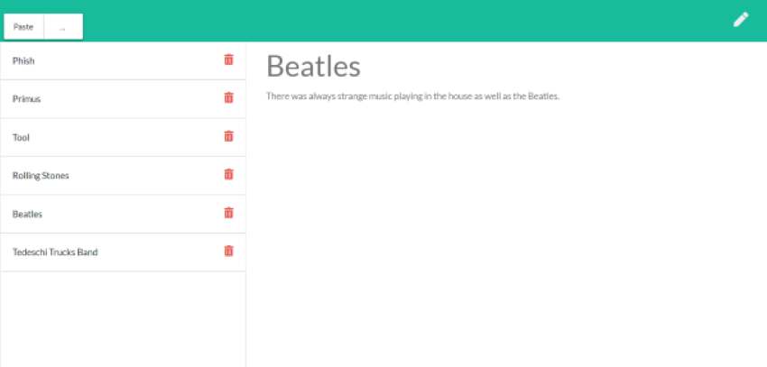

# Note Taker

## Description

This program uses express.js to create a server that allows the user to take, save, and delete notes as they please.

## User Story

AS A user, I want to be able to write and save notes

I WANT to be able to delete notes I've written before

SO THAT I can organize my thoughts and keep track of tasks I need to complete

## Business Context

For users that need to keep track of a lot of information, it's easy to forget or be unable to recall something important. Being able to take persistent notes allows users to have written information available when needed.

## Heroku Deployment
[Click here](https://note-taker-cnm-2020.herokuapp.com/) to interact with the deployment of this app.

## Screenshot

